<div align="center">


<h1>Terraform Modules Platform</h1>

<p><strong>The Strategic Foundation for Reusable, Production-Ready Infrastructure Modules, Multi-Cloud Orchestration, and Automated Infrastructure Governance using Infrastructure as Code</strong></p>

[]()
[]()
[]()

<br/>

> **"Standardized infrastructure is the foundation of scale."** 
> Terraform Modules Platform (TF-Modules) is an enterprise-grade repository designed to provide a secure, measurable, and highly automated foundation for global multi-cloud infrastructure delivery. It orchestrates the complex lifecycle of infrastructure components—from VPC/VNet provisioning and compute instance orchestration to real-time Kubernetes cluster deployment, storage management, and security control enforcement. By providing a centralized catalog of unified networking-as-code modules, automated validation pipelines, and immutable audit trails, it enables organizations to eliminate snowflake configurations, ensure five-nines infrastructure availability, and drive rapid digital transformation across the entire enterprise ecosystem.

</div>

---

## 🏛️ Executive Summary

Manual infrastructure provisioning is an operational bottleneck and a security liability. Organizations fail to scale not because of a lack of cloud resources, but because of fragmented infrastructure standards, lack of reusable module libraries, and an inability to enforce security and tagging policies with operational precision.

This platform provides the **Infrastructure Automation Plane**. It implements a complete **Enterprise IaC Framework**—from modular Networking and Compute engines to specialized Kubernetes and Storage modules. By operationalizing infrastructure as a primary automated capability, it ensures that your global resource landscape is not just "connected," but continuously optimized and delivered with strategic architectural precision.

---

## 🏛️ Core Platform Pillars

1. **Modular Core Infrastructure**: Standardized HCL modules for provisioning secure VPCs, subnets, and routing across multiple clouds.
2. **Standardized Compute & K8s**: Centralized control plane for managing consistent VM instances, container registries, and production-grade Kubernetes clusters.
3. **Encapsulated Storage & DB**: Secured modules for orchestrating object storage, block storage, and managed databases with built-in encryption and lifecycle policies.
4. **Platform Security Modules**: Code-driven enforcement of IAM roles, Security Groups, and network micro-segmentation.
5. **Observability-as-Code**: Advanced orchestration of logging sinks, metric collectors, and monitoring integrations for real-time visibility.
6. **Multi-Cloud Governance**: Policy-driven modules for tagging enforcement, compliance validation, and environment-specific parameterization.

---

## 📐 Architecture Storytelling: 50+ Advanced Diagrams

### 1. The Infrastructure-as-Code Loop
*The flow from module definition to production infrastructure.*
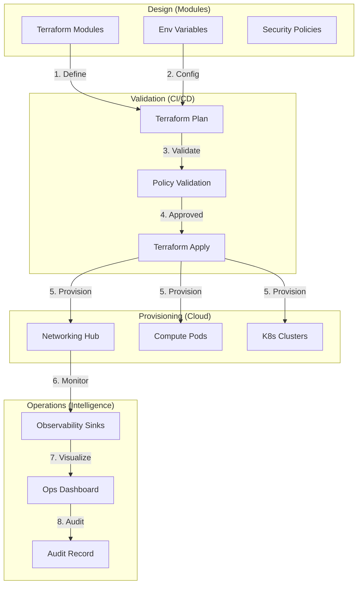

### 2. Modular Infrastructure Topology
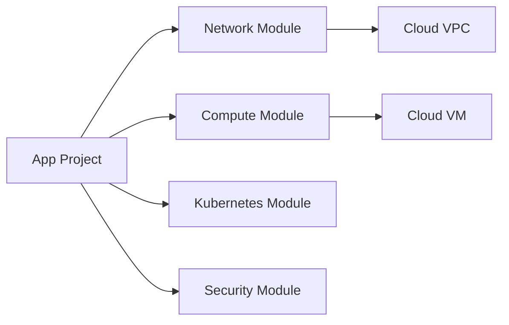

### 3. Environment Abstraction Model
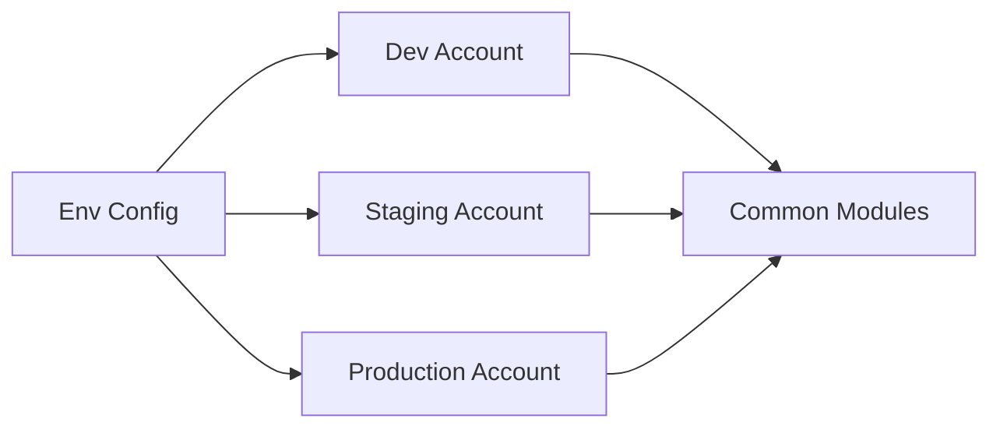

### 4. Terraform Modules Platform Architecture
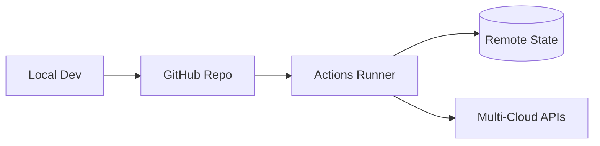

### 5. Deployment Topology: High-Available Hub
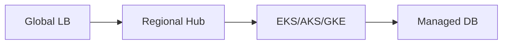

### 6. Module Dependency Graph
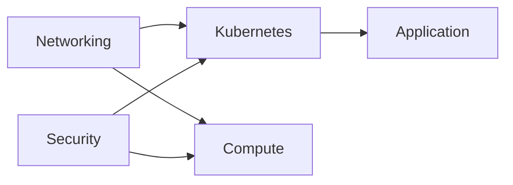

### 7. Foundation: Multi-Environment Setup
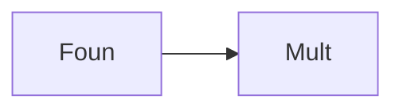

### 8. Networking: Secure Transit Tunnels
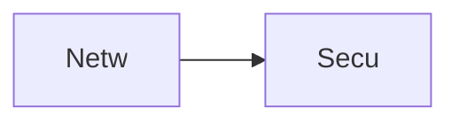

### 9. Component: Compute Module
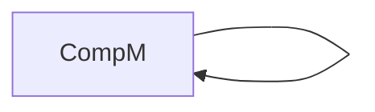

### 10. Component: Networking Module
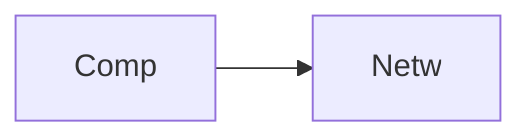

### 11. Component: Storage Module
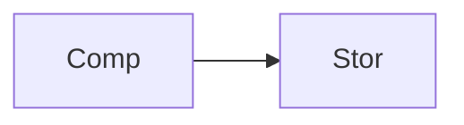

### 12. Component: Kubernetes Module


### 13. Logic: CIDR Allocation
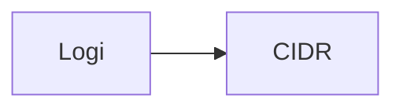

### 14. Logic: State Locking
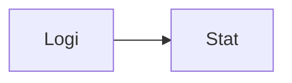

### 15. Logic: Policy Evaluator
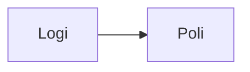

### 16. Logic: Module Composition
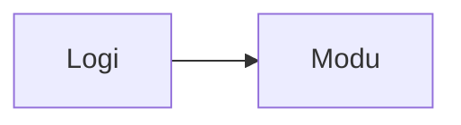

### 17. Architecture: Global Control Plane
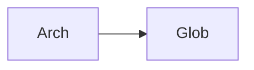

### 18. Architecture: Infrastructure Mesh
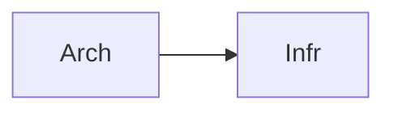

### 19. Architecture: Multi-Sink Logging
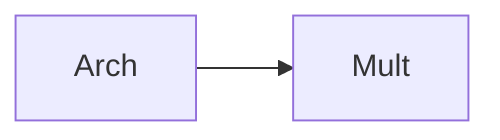

### 20. Pattern: Module Versioning
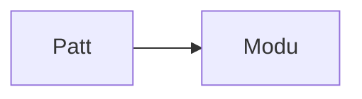

### 21. Pattern: Immutable Infrastructure
```mermaid
graph LR
    P[Patt] --> I[Immu]
```

### 22. Pattern: Automated Recovery
```mermaid
graph LR
    P[Patt] --> A[Auto]
```

### 23. Security: Signed State Files
```mermaid
graph LR
    S[Secu] --> S[Sign]
```

### 24. Security: RBAC Infra Access
```mermaid
graph LR
    S[Secu] --> R[RBAC]
```

### 25. Security: Secure Audit Record
```mermaid
graph LR
    S[Secu] --> S[Secu]
```

### 26. Feature: Resource Heatmap UI
```mermaid
graph LR
    F[Feat] --> R[Reso]
```

### 27. Feature: Real-time Provisioning Logs
```mermaid
graph LR
    F[Feat] --> R[Real]
```

### 28. Feature: Auto-generated Docs
```mermaid
graph LR
    F[Feat] --> A[Auto]
```

### 29. Compliance: NIST Benchmarks
```mermaid
graph LR
    C[Comp] --> N[NIST]
```

### 30. Compliance: Audit Trail Persistence
```mermaid
graph LR
    C[Comp] --> A[Audi]
```

### 31. Infrastructure: S3 Backend
```mermaid
graph LR
    I[Infr] --> S[S3Be]
```

### 32. Infrastructure: DynamoDB Lock
```mermaid
graph LR
    I[Infr] --> D[Dyna]
```

### 33. Deployment: GitHub Action Workers
```mermaid
graph LR
    D[Depl] --> G[GitH]
```

### 34. Deployment: Multi-Region Sync
```mermaid
graph LR
    D[Depl] --> M[Mult]
```

### 35. Monitoring: plan duration KPI
```mermaid
graph LR
    M[Moni] --> P[Plan]
```

### 36. Monitoring: drift detection alerts
```mermaid
graph LR
    M[Moni] --> D[Drif]
```

### 37. UI: Unified Modules Dashboard
```mermaid
graph LR
    U[UI] --> U[Unif]
```

### 38. UI: Module Registry View
```mermaid
graph LR
    U[UI] --> M[Modu]
```

### 39. UI: Environment Diffs View
```mermaid
graph LR
    U[UI] --> E[Envi]
```

### 40. UI: Compliance Scoring Matrix
```mermaid
graph LR
    U[UI] --> C[Comp]
```

### 41. CI/CD: Plan validation pipeline
```mermaid
graph LR
    C[CICD] --> P[Plan]
```

### 42. CI/CD: Module integration tests
```mermaid
graph LR
    C[CICD] --> M[Modu]
```

### 43. Strategy: Module-First Architecture
```mermaid
graph LR
    S[Stra] --> M[Modu]
```

### 44. Strategy: Data-Driven Scaling
```mermaid
graph LR
    S[Stra] --> D[Data]
```

### 45. Feature: Multi-Cloud Peering Bridge
```mermaid
graph LR
    F[Feat] --> M[Mult]
```

### 46. Feature: Real-time Drift Alerts
```mermaid
graph LR
    F[Feat] --> R[Real]
```

### 47. Feature: Cost Allocation Tracking
```mermaid
graph LR
    F[Feat] --> C[Cost]
```

### 48. Logic: Dependency Resolver Engine
```mermaid
graph LR
    L[Logi] --> D[Depe]
```

### 49. Data Model: Infrastructure Entity
```mermaid
graph LR
    D[Data] --> I[Infr]
```

### 50. Enterprise IaC Excellence
```mermaid
graph LR
    E[Entr] --> I[IaCE]
```

---

## 🛠️ Technical Stack & Implementation

### Terraform Engine & Modules
- **IaC**: Terraform 1.0+.
- **Providers**: AWS, Azure, GCP (Modular support).
- **Networking Module**: High-availability VPCs with tiered subnets and IGW/NAT.
- **Compute Module**: Standardized EC2/VM instances with cloud-init support.
- **Storage Module**: Versioned S3/Blob storage with lifecycle policies.
- **K8s Module**: Production-grade EKS/AKS/GKE cluster configurations.
- **State Management**: S3/DynamoDB (AWS) or Terraform Cloud.
- **Validation**: `terraform validate`, `tflint`, and `checkov`.

### CI/CD (GitHub Actions)
- **Plan Workflow**: Triggers on PR to validate infrastructure changes and show resource diff.
- **Apply Workflow**: Triggers on merge to main for environment promotion.

### Infrastructure
- **Hub Architecture**: Transit Gateway / VNet Hub simulation.
- **Security**: Policy-as-code enforcement via OPA or Terraform Sentinels.

---

## 🚀 Deployment Guide

### Local Development
```bash
# Clone the repository
git clone https://github.com/devopstrio/terraform-modules.git
cd terraform-modules

# Choose an environment
cd environments/dev

# Initialize terraform
terraform init

# Plan infrastructure changes
terraform plan

# Apply infrastructure changes
terraform apply
```

---

## 📜 License
Distributed under the MIT License. See `LICENSE` for more information.
