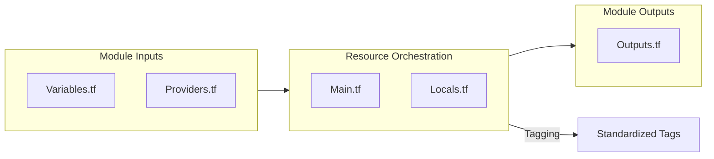
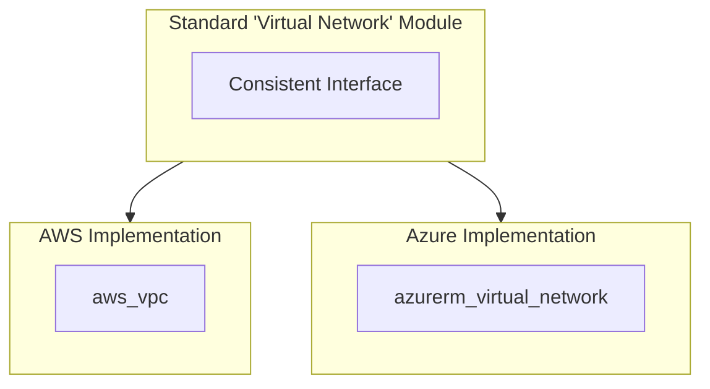
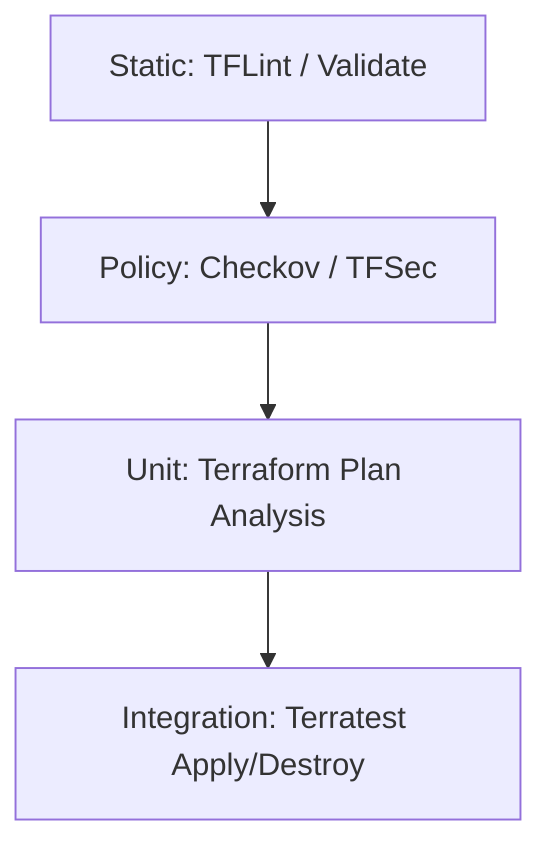
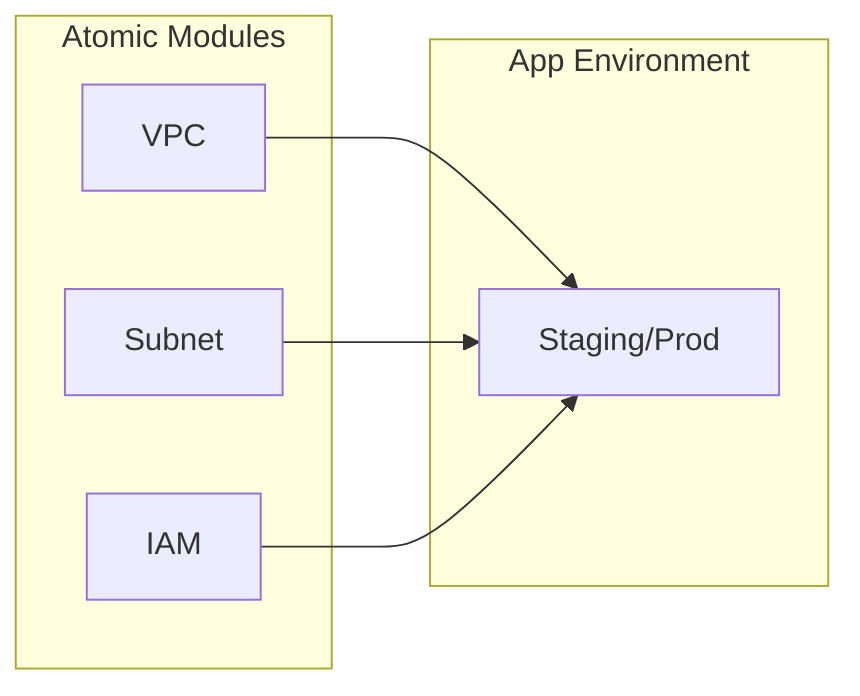
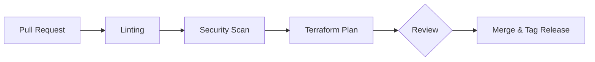
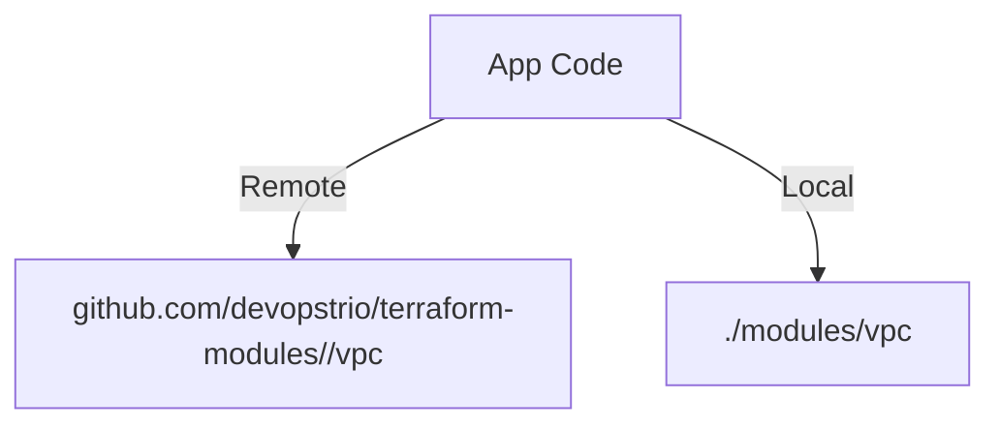
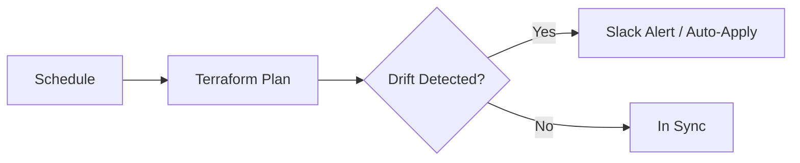
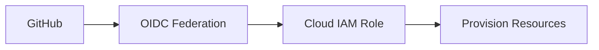

<div align="center">


<h1>Terraform Modules Platform</h1>

<p><strong>The Strategic Foundation for Reusable, Atomic Infrastructure Modules, Multi-Cloud Standardisation, and Automated Infrastructure Governance.</strong></p>

[]()
[]()
[]()

<br/>

> **"Standardised infrastructure is the foundation of scale."** 
> **Terraform Modules Platform (TF-Modules)** is an institutional-grade repository designed to provide a secure, measurable, and highly automated foundation for global multi-cloud infrastructure delivery. It orchestrates the entire lifecycle of atomic infrastructure components—from VPCs and VNets to managed databases and security groups.

</div>

---

## 🏛️ Executive Summary

Manual infrastructure provisioning is an operational bottleneck and a security liability. Organizations often fail to scale not because of a lack of cloud resources, but because of fragmented infrastructure standards and a lack of reusable, well-tested module libraries.

This platform provides the **Infrastructure Automation Plane**. It implements a complete **Enterprise IaC Framework**, enabling engineering teams to manage core networking, compute, and security resources as atomic, versioned modules. By treating infrastructure as a primary automated capability, we ensure that every resource is continuously optimized, tagged, and secured according to strategic architectural standards.

---

## 📐 Architecture Storytelling: Principal Reference Models

### 1. Principal Architecture: Atomic Infrastructure Module Framework
This diagram illustrates the end-to-end flow from module definition to consumption across multi-cloud environments.


```mermaid
graph LR
    %% Subgraph Definitions
    subgraph Registry["Private Module Registry"]
        direction TB
        VPC[Networking Modules]
        Comp[Compute Modules]
        Data[Storage Modules]
        Sec[Security Modules]
    end

    subgraph Intelligence["IaC Intelligence & Testing"]
        direction TB
        Lint[TFLint / Formatting]
        Scan[Checkov / Security Scan]
        Test[Terratest / Integration]
    end

    subgraph Consumption["Application Consumption Zone"]
        App1[Finance App Environment]
        App2[Retail App Environment]
        App3[Data Analytics Stack]
    end

    subgraph MultiCloud["Multi-Cloud Resource Targets"]
        direction TB
        AWS[AWS Resources]
        Azure[Azure Resources]
        GCP[GCP Resources]
    end

    subgraph DevOps["CI/CD & Release Pipeline"]
        direction TB
        GH[GitHub Actions]
        State[Remote State Backend]
        Version[SemVer Tagging]
    end

    %% Flow Arrows
    Registry -->|1. Versioned Release| Version
    Version -->|2. Register| GH
    GH -->|3. Validate| Intelligence
    Intelligence -->|4. Test| MultiCloud
    
    App1 -->|5. Source Module| Registry
    App2 -->|5. Source Module| Registry
    App3 -->|5. Source Module| Registry
    
    GH -->|6. Provision| MultiCloud
    MultiCloud -->|7. Lock| State

    %% Styling
    classDef reg fill:#f5f5f5,stroke:#616161,stroke-width:2px;
    classDef intel fill:#ede7f6,stroke:#311b92,stroke-width:2px;
    classDef consume fill:#fff3e0,stroke:#e65100,stroke-width:2px;
    classDef cloud fill:#e8f5e9,stroke:#1b5e20,stroke-width:2px;
    classDef cicd fill:#fffde7,stroke:#f57f17,stroke-width:2px;

    class Registry reg;
    class Intelligence intel;
    class Consumption consume;
    class MultiCloud cloud;
    class DevOps cicd;
```

### 2. The Module Anatomy: Standardized Interface
The structural design of every atomic module in the library.


```mermaid
graph LR
    subgraph Input["Module Inputs"]
        Vars[Variables.tf]
        Prov[Providers.tf]
    end

    subgraph Core["Resource Orchestration"]
        Main[Main.tf]
        Loc[Locals.tf]
    end

    subgraph Output["Module Outputs"]
        Attr[Outputs.tf]
    end

    Input --> Core
    Core --> Output
    Core -->|Tagging| Tag[Standardized Tags]
```

### 3. Multi-Cloud Resource Mapping
Maintaining consistent interfaces across different cloud providers.


```mermaid
graph TD
    subgraph Standard["Standard 'Virtual Network' Module"]
        IF[Consistent Interface]
    end

    subgraph AWS["AWS Implementation"]
        VPC[aws_vpc]
    end

    subgraph Azure["Azure Implementation"]
        VNet[azurerm_virtual_network]
    end

    Standard --> AWS
    Standard --> Azure
```

### 4. The Testing Pyramid for IaC
Ensuring reliability through tiered validation stages.


```mermaid
graph TD
    T1[Static: TFLint / Validate]
    T2[Policy: Checkov / TFSec]
    T3[Unit: Terraform Plan Analysis]
    T4[Integration: Terratest Apply/Destroy]

    T1 --> T2
    T2 --> T3
    T3 --> T4
```

### 5. Module Dependency & Composition Flow
How developers build complex platforms using small, atomic building blocks.


```mermaid
graph LR
    subgraph Atomic["Atomic Modules"]
        M1[VPC]
        M2[Subnet]
        M3[IAM]
    end

    subgraph Composite["App Environment"]
        Env[Staging/Prod]
    end

    M1 --> Env
    M2 --> Env
    M3 --> Env
```

### 6. CI/CD Pipeline: Module Validation Loop
The automated workflow for contributing new modules or updates.


```mermaid
graph LR
    PR[Pull Request] --> Lint[Linting]
    Lint --> Scan[Security Scan]
    Scan --> Plan[Terraform Plan]
    Plan --> Approval{Review}
    Approval --> Merge[Merge & Tag Release]
```

### 7. Module Consumption: Local vs Remote Source
Patterns for referencing modules in application code.


```mermaid
graph TD
    App[App Code] -->|Remote| Registry["github.com/devopstrio/terraform-modules//vpc"]
    App -->|Local| Filesystem["./modules/vpc"]
```

### 8. Drift Detection & Remediation Loop
Continuous governance to ensure infrastructure matches the code.


```mermaid
graph LR
    Timer[Schedule] --> Plan[Terraform Plan]
    Plan --> Diff{Drift Detected?}
    Diff -->|Yes| Alert[Slack Alert / Auto-Apply]
    Diff -->|No| Success[In Sync]
```

### 9. State Management: S3 + DynamoDB Architecture
The secure foundation for managing Terraform remote state.

```mermaid
graph LR
    Runner[GitHub Actions] --> S3[State Bucket (Encryption)]
    Runner --> DB[DynamoDB (State Locking)]
```

### 10. Identity & RBAC for IaC Operations
Securely authenticating pipelines to cloud providers using OIDC.


```mermaid
graph LR
    GH[GitHub] --> OIDC[OIDC Federation]
    OIDC --> Role[Cloud IAM Role]
    Role --> Action[Provision Resources]
```

---

## 🏛️ Core Platform Pillars

1.  **Modular Core Infrastructure**: Standardized HCL modules for provisioning secure VPCs, subnets, and routing.
2.  **Standardized Compute & K8s**: Centralized control plane for managing consistent VM instances and Kubernetes clusters.
3.  **Encapsulated Storage & DB**: Secured modules for orchestrating object storage and managed databases with built-in encryption.
4.  **Platform Security Modules**: Code-driven enforcement of IAM roles, Security Groups, and network micro-segmentation.
5.  **Observability-as-Code**: Advanced orchestration of logging sinks and metric collectors for real-time visibility.
6.  **Multi-Cloud Governance**: Policy-driven modules for tagging enforcement and environment-specific parameterisation.

---

## 🛠️ Technical Stack & Implementation

### Terraform Engine & Modules
*   **IaC Engine**: Terraform 1.0+.
*   **Cloud Providers**: AWS, Azure, GCP (Modularized).
*   **Networking Module**: High-availability VPCs with tiered subnets.
*   **Compute Module**: Standardized instance configurations with cloud-init.
*   **Storage Module**: Versioned S3/Blob storage with lifecycle policies.
*   **Validation**: `terraform validate`, `tflint`, and `checkov`.

### CI/CD & Registry
*   **Automation**: GitHub Actions with OIDC federation.
*   **State Management**: S3 + DynamoDB (AWS) or Terraform Cloud.
*   **Registry**: GitHub Private Module Registry.

---

## 🏗️ IaC Mapping (Module Structure)

| Module | Purpose | Real Services |
| :--- | :--- | :--- |
| **`modules/networking`** | Foundation connectivity | VPC, VNet, Subnets, Gateways |
| **`modules/compute`** | Runtime resources | EC2, Virtual Machines, ASG |
| **`modules/data`** | Persistent storage | S3, RDS, EBS, Blob Storage |
| **`modules/security`** | Identity and access | IAM, Security Groups, NACLs |

---

## 🚀 Deployment Guide

### Local Principal Environment
```bash
# Clone the repository
git clone https://github.com/devopstrio/terraform-modules.git
cd terraform-modules

# Navigate to a reference environment
cd environments/dev

# Initialize terraform
terraform init

# Plan infrastructure changes
terraform plan

# Apply changes
terraform apply
```

---

## 📜 License
Distributed under the MIT License. See `LICENSE` for more information.

---
<div align="center">
  <p>© 2026 Devopstrio. All rights reserved.</p>
</div>
