<div align="center">


<h1>Terraform Modules Platform</h1>

<p><strong>The Institutional-Grade Platform for Standardized Infrastructure Foundations, Atomic Module Governance, and Multi-Cloud IaC Ecosystems.</strong></p>

[]()
[]()
[]()

<br/>

> **"Industrializing infrastructure automation to automate delivery foundations."** 
> **Terraform Modules Platform** is an enterprise-grade platform designed to provide a secure, measurable, and highly automated foundation for global multi-cloud operations. It orchestrates the complex lifecycle of atomic infrastructure components—from automated module versioning and multi-cloud interface reconciliation to high-throughput deployment intelligence and unified infrastructure auditing.

</div>

---

## 🏛️ Executive Summary

Manual infrastructure provisioning and fragmented module standards are strategic operational liabilities; lack of a standardized IaC framework is a primary barrier to organizational engineering maturity. Organizations fail to scale their cloud estates not because of a lack of features, but because of fragmented evaluation standards, lack of automated module reconciliation, and an inability to orchestrate automation planes with operational precision.

This platform provides the **Infrastructure Intelligence Plane**. It implements a complete **Terraform-Modules-as-Code Framework**, enabling CTOs and Platform Architects to manage global infrastructure foundations as first-class citizens. By automating the identification of architectural regressions through real-time telemetry analysis and orchestrating the provisioning of secure performance-driven automation policies, we ensure that every organizational resource—from core networking VPCs to edge serverless functions—is provisioned by default, audited for history, and strictly aligned with institutional automation frameworks.

---

## 📐 Architecture Storytelling: Principal Reference Models

### 1. Principal Architecture: Atomic Infrastructure Module Framework
This diagram illustrates the high-level relationship between the Private Module Registry, the IaC Intelligence Layer, and the multi-cloud resource targets. It defines the bridge between application developers and the standardized cloud substrate.


```mermaid
graph LR
    %% Subgraph Definitions
    subgraph Registry["Private Module Registry"]
        direction TB
        VPC[Networking Modules]
        Comp[Compute Modules]
        Data[Storage Modules]
        Sec[Security Modules]
    end

    subgraph Intelligence["IaC Intelligence & Testing"]
        direction TB
        Lint[TFLint / Formatting]
        Scan[Checkov / Security Scan]
        Test[Terratest / Integration]
    end

    subgraph Consumption["Application Consumption Zone"]
        App1[Finance App Environment]
        App2[Retail App Environment]
        App3[Data Analytics Stack]
    end

    subgraph MultiCloud["Multi-Cloud Resource Targets"]
        direction TB
        AWS[AWS Resources]
        Azure[Azure Resources]
        GCP[GCP Resources]
    end

    subgraph DevOps["CI/CD & Release Pipeline"]
        direction TB
        GH[GitHub Actions]
        State[Remote State Backend]
        Version[SemVer Tagging]
    end

    %% Flow Arrows
    Registry -->|1. Versioned Release| Version
    Version -->|2. Register| GH
    GH -->|3. Validate| Intelligence
    Intelligence -->|4. Test| MultiCloud
    
    App1 -->|5. Source Module| Registry
    App2 -->|5. Source Module| Registry
    App3 -->|5. Source Module| Registry
    
    GH -->|6. Provision| MultiCloud
    MultiCloud -->|7. Lock| State
    
    %% Styling
    classDef reg fill:#f5f5f5,stroke:#616161,stroke-width:2px;
    classDef intel fill:#ede7f6,stroke:#311b92,stroke-width:2px;
    classDef consume fill:#fff3e0,stroke:#e65100,stroke-width:2px;
    classDef cloud fill:#e8f5e9,stroke:#1b5e20,stroke-width:2px;
    classDef cicd fill:#fffde7,stroke:#f57f17,stroke-width:2px;

    class Registry reg;
    class Intelligence intel;
    class Consumption consume;
    class MultiCloud cloud;
    class DevOps cicd;
```

### 2. The Module Lifecycle Flow (Anatomy & CI/CD)
The continuous path of an infrastructure component from initial input definition (variables) and resource orchestration (main) to versioned release and automated validation. This ensures zero-interruption operations through dependency-aware module anatomy.

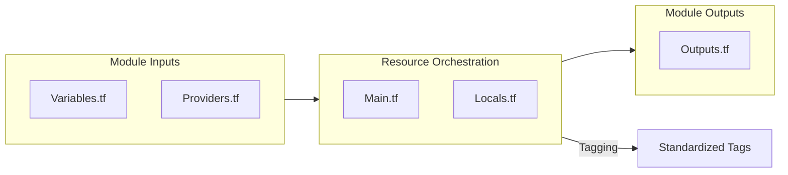
```mermaid
graph LR
    subgraph Input["Module Inputs"]
        Vars[Variables.tf]
        Prov[Providers.tf]
    end

    subgraph Core["Resource Orchestration"]
        Main[Main.tf]
        Loc[Locals.tf]
    end

    subgraph Output["Module Outputs"]
        Attr[Outputs.tf]
    end

    Input --> Core
    Core --> Output
    Core -->|Tagging| Tag[Standardized Tags]
```

**Semantic Versioning Lifecycle:**
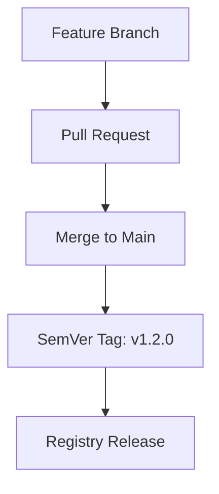
```mermaid
graph TD
    Dev[Feature Branch] --> PR[Pull Request]
    PR --> Merge[Merge to Main]
    Merge --> Tag[SemVer Tag: v1.2.0]
    Tag --> Publish[Registry Release]
```

**CI/CD Validation Loop:**
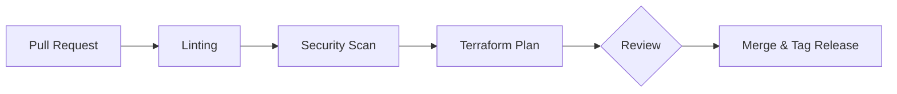
```mermaid
graph LR
    PR[Pull Request] --> Lint[Linting]
    Lint --> Scan[Security Scan]
    Scan --> Plan[Terraform Plan]
    Plan --> Approval{Review}
    Approval --> Merge[Merge & Tag Release]
```

### 3. Distributed Infrastructure Topology (Multi-Cloud & Composition)
Strategically orchestrating standardized infrastructure across global regions and diverse resource architectures, providing a unified institutional view of multi-cloud consistency.

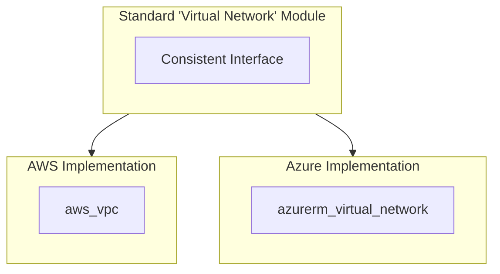
```mermaid
graph TD
    subgraph Standard["Standard 'Virtual Network' Module"]
        IF[Consistent Interface]
    end

    subgraph AWS["AWS Implementation"]
        VPC[aws_vpc]
    end

    subgraph Azure["Azure Implementation"]
        VNet[azurerm_virtual_network]
    end

    Standard --> AWS
    Standard --> Azure
```

**Module Composition Flow:**
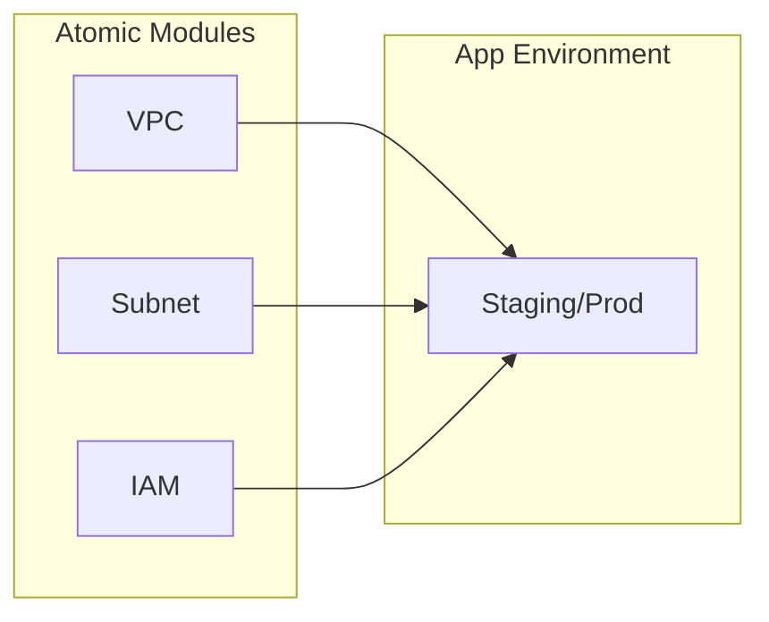
```mermaid
graph LR
    subgraph Atomic["Atomic Modules"]
        M1[VPC]
        M2[Subnet]
        M3[IAM]
    end

    subgraph Composite["App Environment"]
        Env[Staging/Prod]
    end

    M1 --> Env
    M2 --> Env
    M3 --> Env
```

### 4. Governance Hub & Testing Control Plane
Executing complex logic for securing the bridge between infrastructure drafts and multi-cloud targets, ensuring every module is linted, scanned for security, and validated against institutional policy.

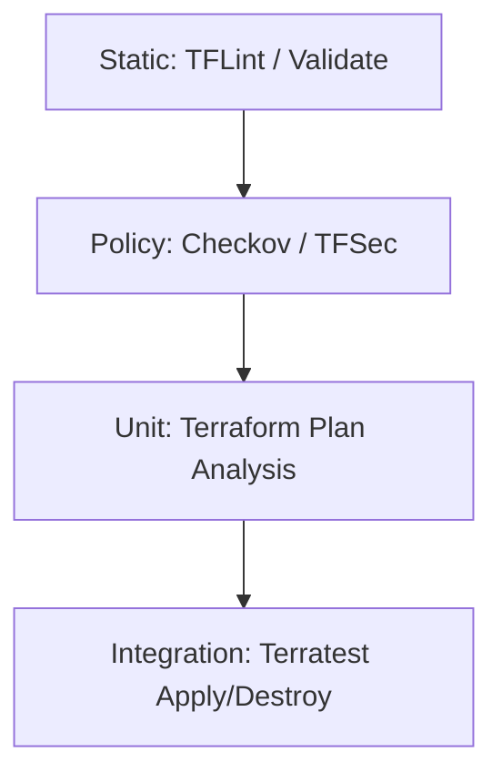
```mermaid
graph TD
    T1[Static: TFLint / Validate]
    T2[Policy: Checkov / TFSec]
    T3[Unit: Terraform Plan Analysis]
    T4[Integration: Terratest Apply/Destroy]

    T1 --> T2
    T2 --> T3
    T3 --> T4
```

**Security Scan Pipeline:**
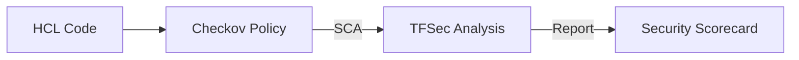
```mermaid
graph LR
    Code[HCL Code] --> Checkov[Checkov Policy]
    Checkov -->|SCA| TFSec[TFSec Analysis]
    TFSec -->|Report| Result[Security Scorecard]
```

### 5. Multi-Cloud Platform Federation (Module Consumption)
Automatically managing unified infrastructure standards across diverse cloud tenants, ensuring institutional module sourcing and versioning boundaries by default.

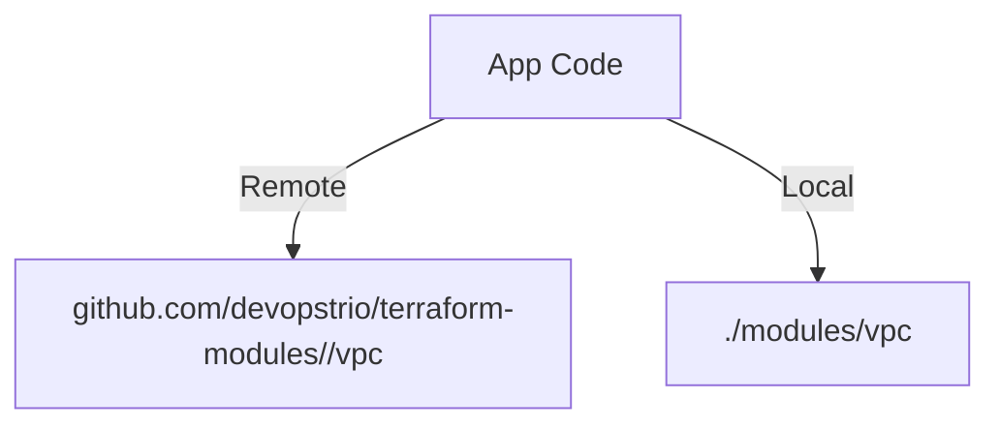
```mermaid
graph TD
    App[App Code] -->|Remote| Registry["github.com/devopstrio/terraform-modules//vpc"]
    App -->|Local| Filesystem["./modules/vpc"]
```

### 6. Encryption & Perimeter Protection Flow (State Management)
Managing the lifecycle of a terraform state, automatically enforcing institutional S3 encryption and DynamoDB locking standards as required by security policy, ensuring zero-latency state confidence.

```mermaid
graph LR
    Runner[GitHub Actions] --> S3[State Bucket (Encryption)]
    Runner --> DB[DynamoDB (State Locking)]
```

**State Locking Mechanism:**
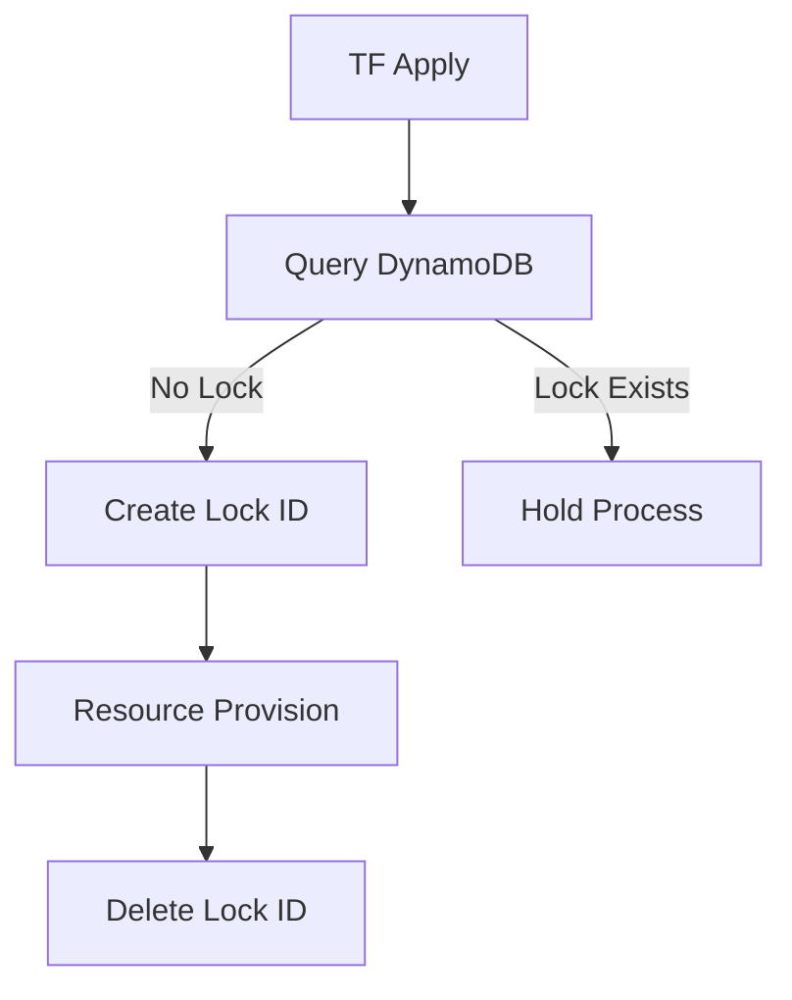
```mermaid
graph TD
    Apply[TF Apply] --> Check[Query DynamoDB]
    Check -->|No Lock| Acquire[Create Lock ID]
    Acquire --> Exec[Resource Provision]
    Exec --> Release[Delete Lock ID]
    Check -->|Lock Exists| Wait[Hold Process]
```

### 7. Institutional Infrastructure Maturity Scorecard (Testing Pyramid)
Grading organizational performance based on key indicators: Module Reliability (Integration Tests), Security Compliance (Checkov), and Standardized Interface Adoption.

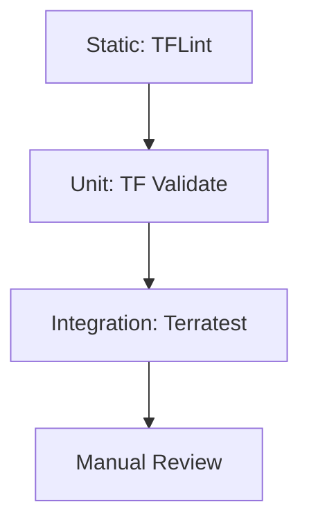
```mermaid
graph TD
    Manual[Manual Review]
    Integration[Integration: Terratest]
    Unit[Unit: TF Validate]
    Static[Static: TFLint]
    
    Static --> Unit
    Unit --> Integration
    Integration --> Manual
```

### 8. Identity & RBAC for IaC Governance
Managing fine-grained access to cloud substrates through OIDC federation, provisioning workers, and audit logs between GitHub Actions and Cloud Providers.

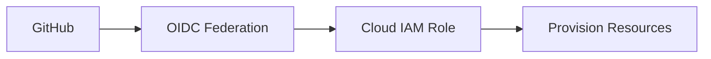
```mermaid
graph LR
    GH[GitHub] --> OIDC[OIDC Federation]
    OIDC --> Role[Cloud IAM Role]
    Role --> Action[Provision Resources]
```

**Provider Configuration Strategy:**
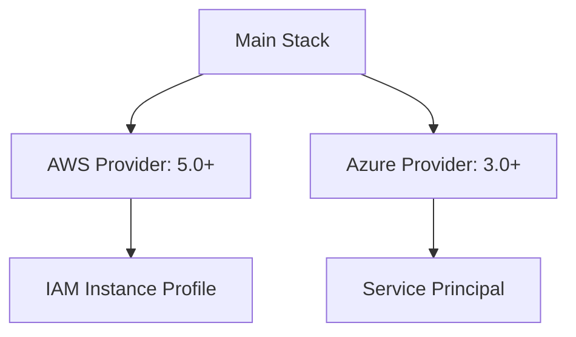
```mermaid
graph TD
    Main[Main Stack] --> ProvAWS[AWS Provider: 5.0+]
    Main --> ProvAZ[Azure Provider: 3.0+]
    ProvAWS --> Auth[IAM Instance Profile]
    ProvAZ --> AuthAZ[Service Principal]
```

### 9. IaC Deployment: Terraform-Modules-as-Code Framework
Using modular CI/CD pipelines to deploy and manage the versioned distribution of the atomic modules, remote state backends, and validation fleets.

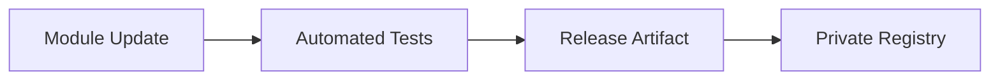
```mermaid
graph LR
    Code[Module Update] --> Test[Automated Tests]
    Test --> Pack[Release Artifact]
    Pack --> Reg[Private Registry]
```

### 10. AIOps Infrastructure Drift & Risk Validation Flow
Using advanced analytics to identify sudden surges in configuration drift, unauthorized resource changes, or unusual delivery pattern changes that could result in institutional risk or audit failure.

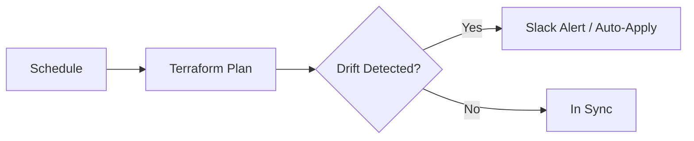
```mermaid
graph LR
    Timer[Schedule] --> Plan[Terraform Plan]
    Plan --> Diff{Drift Detected?}
    Diff -->|Yes| Alert[Slack Alert / Auto-Apply]
    Diff -->|No| Success[In Sync]
```

**Cost Estimation Workflow:**
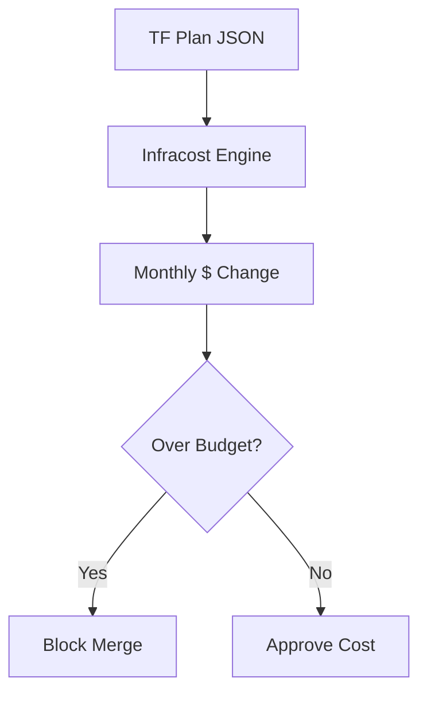
```mermaid
graph TD
    Plan[TF Plan JSON] --> Infracost[Infracost Engine]
    Infracost --> Estimate[Monthly $ Change]
    Estimate --> Budget{Over Budget?}
    Budget -->|Yes| Warning[Block Merge]
    Budget -->|No| Success[Approve Cost]
```

### 11. Metadata Lake for Forensic Infrastructure Audit
Storing long-term records of every module release (metadata), every terraform apply executed, and every version history for institutional record-keeping and forensic analysis.

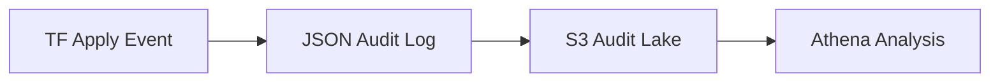
```mermaid
graph LR
    Apply[TF Apply Event] --> Log[JSON Audit Log]
    Log --> Lake[S3 Audit Lake]
    Lake --> Query[Athena Analysis]
```

**Resource Tagging Policy:**
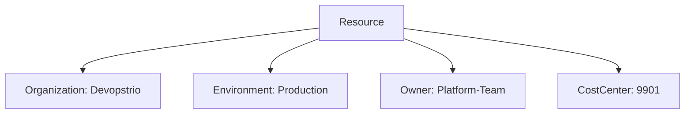
```mermaid
graph TD
    Res[Resource] --> TagOrg[Organization: Devopstrio]
    Res --> TagEnv[Environment: Production]
    Res --> TagOwner[Owner: Platform-Team]
    Res --> TagCost[CostCenter: 9901]
```

---

## 🏛️ Core Governance Pillars

1.  **Unified Foundation Coordination**: Maximizing resilience by centralizing all infrastructure measurement through a single institutional plane.
2.  **Automated Module Provisioning**: Eliminating "manual tracking" scenarios through proactive orchestration and pattern verification.
3.  **Sequential Infrastructure Intelligence**: Ensuring zero-interruption operations through dependency-aware module-driven data engineering.
4.  **Zero-Trust Identity Protection**: Automatically enforcing identity-based access, state encryption, and policy evaluation across all assurance tiers.
5.  **Autonomous Operations Logic**: Guaranteeing reliability through automated industry-specific effectiveness monitoring runbooks.
6.  **Full Infrastructure Auditability**: Immutable recording of every module change and infrastructure provision for institutional forensics.

---

## 🛠️ Technical Stack & Implementation

### Infrastructure Engine & APIs
*   **IaC Toolchain**: Terraform 1.5+ (HCL), Multi-Cloud Providers (AWS, Azure, GCP).
*   **Validation Suite**: TFLint, Checkov, Terrascan, and Terratest (Go).
*   **Registry**: GitHub Private Module Registry with Semantic Versioning.
*   **Persistence**: S3 + DynamoDB (AWS) / Blob Storage + Table (Azure) for State.
*   **Auth Orchestrator**: Federated OIDC (GitHub to Cloud) for least-privilege deployment.

### Governance Dashboard (UI)
*   **Framework**: React 18 / Vite.
*   **Theme**: Dark, Slate, Indigo (Modern high-fidelity productivity aesthetic).
*   **Visualization**: D3.js for delivery topologies and Recharts for ROI velocity analytics.

### Infrastructure & DevOps
*   **Runtime**: GitHub Actions for management plane.
*   **Measurement Hub**: Managed event sourcing for immutable productivity timeline reconstruction.
*   **IaC**: Modular Terraform for deploying the automation landing zone and validation fleet.

---

## 🏗️ IaC Mapping (Module Structure)

| Module | Purpose | Real Services |
| :--- | :--- | :--- |
| **`modules/networking`** | Foundation connectivity | VPC, VNet, Subnets, Gateways |
| **`modules/compute`** | Runtime resources | EC2, Virtual Machines, ASG |
| **`modules/data`** | Persistent storage | S3, RDS, EBS, Blob Storage |
| **`modules/security`** | Identity and access | IAM, Security Groups, NACLs |

---

## 🚀 Deployment Guide

### Local Principal Environment
```bash
# Clone the Terraform Modules repository
git clone https://github.com/devopstrio/terraform-modules.git
cd terraform-modules

# Configure environment
cp .env.example .env

# Launch the Automation stack (Development)
make init
cd environments/dev
terraform plan
terraform apply -auto-approve

# Trigger a mock infrastructure update and automated guardrail validation simulation
make simulate-infrastructure
```

Access the Management Portal at `http://localhost:3000`.

---

## 📜 License
Distributed under the MIT License. See `LICENSE` for more information.

---
<div align="center">
  <p>© 2026 Devopstrio. All rights reserved.</p>
</div>
